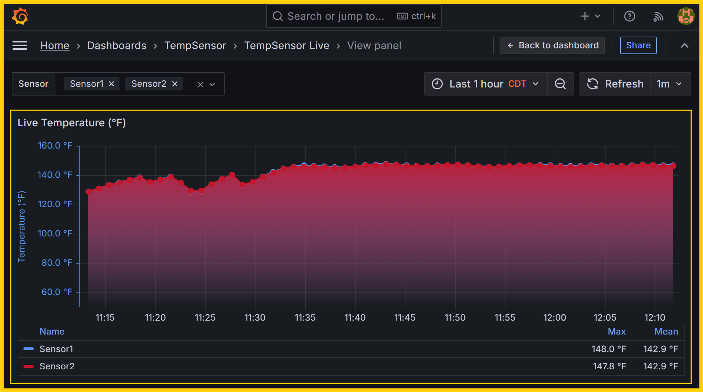
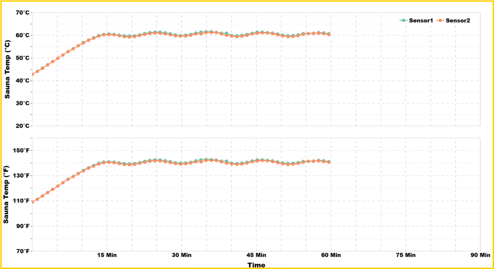
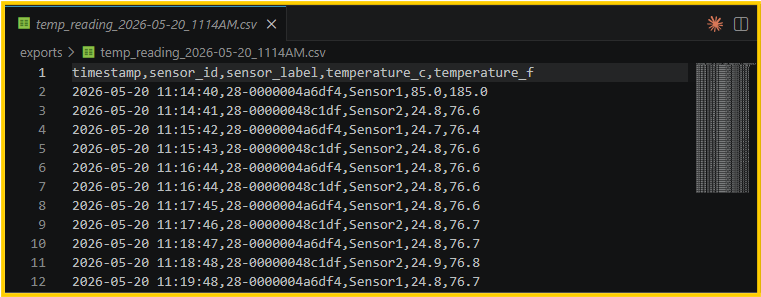

# SensWare : Sensor MQTT Logger and Vizualizer 

Real-time **DS18B20** temperatures on a Raspberry Pi: **MQTT → InfluxDB → Grafana**, with every reading also saved to CSV.

### Data flow : 
```
DS18B20  →  mqtt-publisher  →  MQTT  →  Telegraf  →  InfluxDB  →  Grafana
                    └→  exports/YYYY-MM-DD_HHMMAM_TestUnit_serialNumber.csv

```






### Project structure

```
TempSensor/
├── README.md
├── Makefile              # make startReadSensor / make stopReadSensor
├── LICENSE
├── AUTHORS.md
├── docker-compose.yml
├── publisher/              # sensor read + MQTT + CSV
├── stack/                  # Mosquitto, Telegraf, Grafana
├── scripts/
├── Visualize/              # Plotly PNG — see docs/CUSTOM_VISUALIZER.md
├── docs/
├── WebApp/                 # PostgreSQL + Django long-term test DB (separate stack)
└── exports/                # active CSV + archive/ (gitignored)
```

---

# How to run

From the project root (directory that contains this `Makefile` and `docker-compose.yml`):

```bash
cd ~/Projects/TempSensor
```

#### 1. Check 1-Wire

```bash
ls /sys/bus/w1/devices/28-*
```

If empty: enable 1-Wire in `sudo raspi-config`, reboot — see [docs/ADDING_SENSORS.md](docs/ADDING_SENSORS.md).

#### 2. Configure sensors

Edit `publisher/sensor/ds18b20_reader.py` — set `SENSOR_MAP`.

#### 3. Secrets

```bash
cp .env.example .env
nano .env
```

Timezone wrong (UTC vs Chicago)? See [docs/TIMEZONE.md](docs/TIMEZONE.md).

#### 4. Start the stack

From `~/Projects/TempSensor` (repo root — not `WebApp/`):

```bash
cd ~/Projects/TempSensor
make startReadSensor
```

Prompts for **TestUnit** and **Serial Number**, then starts Docker (custom CSV name).

Stop: `make stopReadSensor` — (`make help` lists all targets; uses `sudo` only if your user cannot run `docker` directly.)

#### 5. Open Grafana

http://localhost:3000 → login from `.env` → **Dashboards → TempSensor → TempSensor Live**

```bash
tail -f exports/*.csv
sudo docker compose logs mqtt-publisher --tail 5
```


---

# Configuration (`.env`)

| Variable | Purpose |
|----------|---------|
| `INFLUXDB_*` | InfluxDB — see [docs/INFLUXDB.md](docs/INFLUXDB.md) |
| `GRAFANA_ADMIN_*` | Grafana login |
| `MQTT_TOPIC` | Default `tempsensor/readings` |
| `SAMPLE_INTERVAL` | Seconds between reads and CSV rows (default `60`, one per minute) |
| `TEST_UNIT` | Test unit label in CSV/PNG filename (e.g. `Pro18.1`) |
| `SERIAL_NUMBER` | Serial number in CSV/PNG filename (e.g. `73216-0098`) |
| `CSV_DIR` | Directory for per-run CSV files (default `exports`) |
| `VISUALIZE_OUTPUT_DIR` | PNG output — see [docs/CUSTOM_VISUALIZER.md](docs/CUSTOM_VISUALIZER.md) |
| `TZ` | Default `America/Chicago` — see [docs/TIMEZONE.md](docs/TIMEZONE.md) |

---

## Data 

Each time the publisher starts, it creates a new file under `exports/`, for example
`2026-05-18_936PM_Pro18.1_73216-0098.csv` (date, time, TestUnit, serial).

On `docker compose up`, any CSV files in `exports/` are moved to `exports/archive/` before a new run file is created.

Columns: `timestamp`, `elapsed_time_in_Min`, `Timer_in_Min`, `sensor_id`, `sensor_label`, `temperature_c`, `temperature_f` (`elapsed_time_in_Min`: 0, 1, 2, …; `Timer_in_Min` counts down from 90: 90, 89, 88, …)

Presentation PNG from the latest CSV: [docs/CUSTOM_VISUALIZER.md](docs/CUSTOM_VISUALIZER.md).

---

# Real-time visualization : Grafana 

- Auto-built from `stack/grafana/dashboards/tempsensor-live.template.json`
- Customize in the UI → **Save dashboard** (stored in `grafana_data` volume)
- Reset layout: `docker compose down -v && docker compose up -d --build`

---

# Automation

| Command / script | Use |
|------------------|-----|
| `make startReadSensor` | Prompt TestUnit/serial + start stack (replaces `compose-up.sh`) |
| `make stopReadSensor` | Stop stack + plot PNG (replaces `compose-down.sh`) |
| `make help` | List all Makefile targets |
| `scripts/compose-up.sh` | Called by `make startReadSensor` |
| `scripts/install-docker.sh` | Install Docker on Pi (`sudo`) |
| `scripts/check_pipeline.sh` | Test MQTT, CSV, Influx |
| `scripts/clean_influx_data.sh` | Erase InfluxDB — see [docs/INFLUXDB.md](docs/INFLUXDB.md) |
| `scripts/setup_timezone.sh` | Pi NTP + `America/Chicago` — see [docs/TIMEZONE.md](docs/TIMEZONE.md) |
| `scripts/firstTimeSetup.sh` | Optional host Python venv |
| `scripts/compose-down.sh` | Called by `make stopReadSensor` — see [docs/CUSTOM_VISUALIZER.md](docs/CUSTOM_VISUALIZER.md) |
| `scripts/plot_latest_csv.sh` | Refresh PNG — see [docs/CUSTOM_VISUALIZER.md](docs/CUSTOM_VISUALIZER.md) |

---

# Documentation

| Guide | Contents |
|-------|----------|
| [docs/ADDING_SENSORS.md](docs/ADDING_SENSORS.md) | Add DS18B20 sensors |
| [docs/TIMEZONE.md](docs/TIMEZONE.md) | Chicago / CDT timezone and NTP |
| [docs/INFLUXDB.md](docs/INFLUXDB.md) | InfluxDB config, queries, cleanup |
| [docs/CUSTOM_VISUALIZER.md](docs/CUSTOM_VISUALIZER.md) | Plotly PNG charts from CSV |
| [WebApp/README.md](WebApp/README.md) | Product test DB — `cd WebApp && make startwebapp` |
| [docs/AUTHORS.md](AUTHORS.md) | About the Author |

---

#### Do not commit

`.env`, `venv/`, `exports/*.csv`, `TempSensor Live-*.json`

---

## License and author

Licensed under the [MIT License](LICENSE). You may use, copy, modify, and distribute this software for any purpose, including commercial use, provided the copyright notice and license text are included.

Copyright (c) 2026 [Bek Kobro](https://bekcsys.com/about). See [AUTHORS.md](AUTHORS.md).
